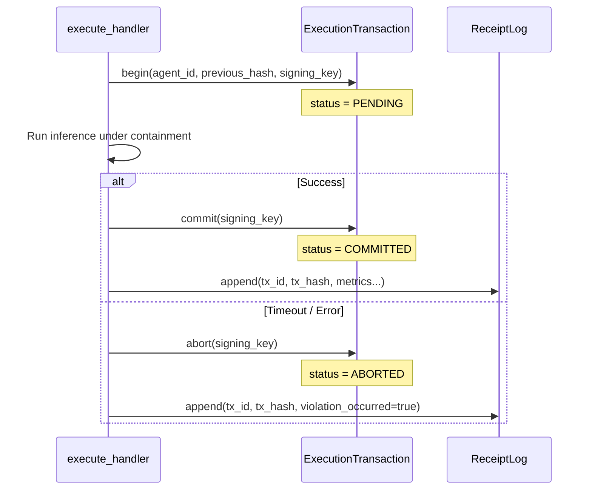

# Transaction Boundary

Every execution in the Runtime is bracketed by an **`ExecutionTransaction`** — a signed, hash-chained record that marks the beginning and end of an execution unit. The transaction is sealed before the execution receipt is emitted, and the receipt carries the transaction's identifier and hash, binding the two records together cryptographically.

---

## Purpose

The transaction boundary serves two roles:

1. **Atomicity marker** — it makes the PENDING → COMMITTED / ABORTED lifecycle of an execution auditable. A receipt that references a COMMITTED transaction confirms the execution completed successfully. A receipt referencing an ABORTED transaction records a timeout or failure.

2. **Lineage anchor** — Overture links every `execution_lineage` row to its bounding transaction via `transaction_id` and `transaction_hash`. This allows the audit trail to be reconstructed even if individual receipts are queried in isolation.

---

## Transaction states

| State | Description |
|---|---|
| `PENDING` | Transaction has been opened; execution is in progress |
| `COMMITTED` | Execution completed successfully; transaction is sealed |
| `ABORTED` | Execution timed out or failed; transaction is sealed |

Both `COMMITTED` and `ABORTED` are terminal states. A transaction cannot be re-sealed.

---

## Transaction record structure

```json
{
  "transaction_id": "0194f3b2-1a2c-7000-8000-000000000000",
  "agent_id": "agent-abc123",
  "status": "COMMITTED",
  "started_at": "2026-02-21T10:00:00.000Z",
  "committed_at": "2026-02-21T10:00:00.380Z",
  "previous_hash": "sha256:001122...",
  "hash": "sha256:334455...",
  "signature": "base64:MEQ..."
}
```

| Field | Description |
|---|---|
| `transaction_id` | UUIDv7 assigned at `begin()` |
| `agent_id` | Agent that owns this transaction |
| `status` | `PENDING`, `COMMITTED`, or `ABORTED` |
| `started_at` | ISO-8601 UTC timestamp of `begin()` |
| `committed_at` | ISO-8601 UTC timestamp of `commit()` (omitted for ABORTED) |
| `aborted_at` | ISO-8601 UTC timestamp of `abort()` (omitted for COMMITTED) |
| `previous_hash` | SHA-256 of the preceding transaction in the chain |
| `hash` | SHA-256 of this record's canonical JSON (excluding `signature`) |
| `signature` | Ed25519 signature over `hash` |

---

## Lifecycle sequence



The transaction record is signed at the time of sealing (commit or abort). The receipt then embeds `transaction_id` and `transaction_hash` from the sealed record, making the link between the two unforgeable.

---

## Canonical signing

Transaction records use the same BTreeMap canonical-JSON algorithm as execution envelopes and receipts:

1. All non-`None` fields (excluding `signature`) are inserted into a BTreeMap.
2. The BTreeMap is serialised to compact JSON with alphabetical key ordering.
3. The result is SHA-256 hashed.
4. The hash is signed with the Runtime's Ed25519 private key.

Optional fields (`committed_at`, `aborted_at`) are included in the canonical form only when set, ensuring the signature covers the exact record state at the time of sealing.

---

## Hash chaining

Transactions form their own hash chain independent of the receipt chain. Each transaction's `previous_hash` points to the hash of the preceding transaction. The first transaction in the Runtime's history uses an empty string as `previous_hash`.

This means the full sequence of executions — not just individual receipts — forms a tamper-evident chain.

---

## Relationship to execution receipts

An execution receipt and its bounding transaction are related as follows:

```
ExecutionTransaction (COMMITTED)
  └─ hash: sha256:334455...

ExecutionReceipt
  ├─ transaction_id: "0194f3b2-..."   (same as transaction)
  └─ transaction_hash: "sha256:334455..."  (hash of the sealed transaction)
```

Overture verifies both records independently before persisting either. If the transaction hash in the receipt does not match the actual transaction, the lineage row is not written.

---

## Related

- [Execution Receipts](/docs/governance/execution-receipts)
- [Capability Model](/docs/governance/capability-model)
- [Agent Lifecycle](/docs/governance/agent-lifecycle)
- [Execution Envelope](/docs/architecture/execution-envelope)
